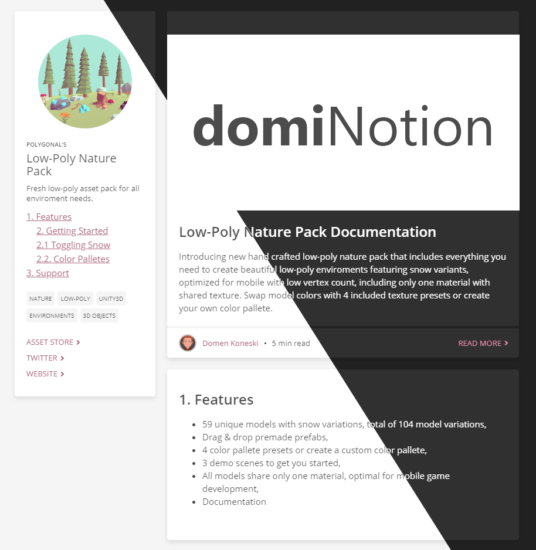
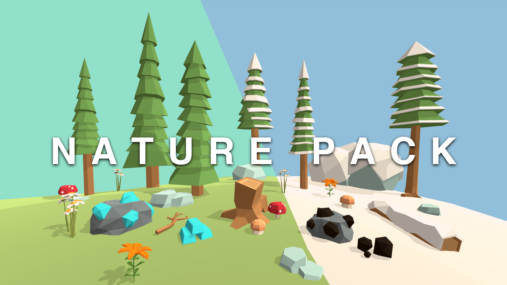
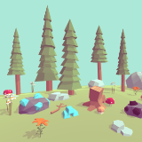

Simple single page and documentation style sheets.

# Features

- Create beautiful material-like blog, documentation or single page website,
- Light and dark themes included,
- Responsive web design, ready for mobile screens,
- No scripting needed

# Installation

Grab `dominotion.css` or minified version `dominotion.min.css`. Check `example.html` for an extended example.

# Guide

## 1. Basic Elements

### 1.1. A Box Container

Box container (or a card) can include a title, images, body text and bottom "more info" section:

```html
<div class="box">
     <!-- Box image -->
    <div class="txt bold large mt20">Low-Poly Nature Pack Documentation</div> <!-- Box title -->
    <div class="txt mt20"> <!-- Box body content -->
        Introducing new hand crafted low-poly nature pack that includes everything 
        you need to create beautiful low-poly enviroments featuring snow variants, 
        optimized for mobile with low vertex count, including only one material 
        with shared texture. Swap model colors with 4 included texture presets 
        or create your own color pallete.
    </div>
    <div class="info"> <!-- (Optional) Box "more info" section -->
        
        <div class="txt small accent">Author Name</div>
        <div class="dot-divider mr10 ml10"></div>
        <div class="txt small">5 min read</div>
        <a href="#" class="btn more small mlauto">READ MORE<div class="arrow"></div></a>
    </div>
</div>
```

### 1.2. Side Panel

Side menu is an optional element. Here you can provide the user with basic information about the product you are showcasing/documenting, table of contents, tags and external links.

```html
<div class="side-menu">
      <!-- Icon and texts -->
    <div class="txt extra-small bold mt20">POLYGONAL'S</div>
    <div class="txt title mt5">Low-Poly Nature Pack</div>
    <div class="txt small mt10">Fresh low-poly asset pack for all enviroment needs.</div>
    <div class="contents mt10">  <!-- Table of contents -->
        <a class="lvl-1" href="#features">1. Features</a> 
        <a class="lvl-2" href="#getting-started">2. Getting Started</a> 
        <a class="lvl-2" href="#toggling-snow">2.1 Toggling Snow</a> 
        <a class="lvl-2" href="#color-palletes">2.2. Color Palletes</a>
        <a class="lvl-1" href="#support">3. Support</a>
    </div>
    <div class="tags mt20"> <!-- Tags -->
        <div class="tag">NATURE</div>
        <div class="tag">LOW-POLY</div>
        <div class="tag">UNITY3D</div>
        <div class="tag">ENVIRONMENTS</div>
        <div class="tag">3D OBJECTS</div>
    </div>
    <div class="links mt20">  <!-- Links -->
        <a href="#" class="btn more small">ASSET STORE<div class="arrow"></div></a>
        <a href="#" class="btn more small">TWITTER<div class="arrow"></div></a>
        <a href="#" class="btn more small">WEBSITE<div class="arrow"></div></a>
    </div>
</div>
```

These two examples should provide you with enough information to get you started.

## 2. Predefined Classes

`domiNotion` has a few predefined classes for spacings/margins so you don't have to write any additional `css` files. For an extended use check `example.html`

```css
.mt5  { margin-top: 5px; }
.mt10 { margin-top: 10px; }
.mt20 { margin-top: 20px; }
.ml5  { margin-left: 5px; }
.ml10 { margin-left: 10px;}
.ml20 { margin-left: 20px; }
.mlauto { margin-left: auto; }
.mr5  { margin-right: 5px; }
.mr10 { margin-right: 10px; }
.mr20 { margin-right: 20px; }
.mrauto { margin-right: auto; }
.mb5  { margin-bottom: 5px; }
.mb10 { margin-bottom: 10px; }
.mb20 { margin-bottom: 20px; }
```

## 3. Themes

`domiNotion` is packed with two default themes, light and dark. Select the theme with setting `body` class:

```html
<body class="light | dark">
...
</body>
```